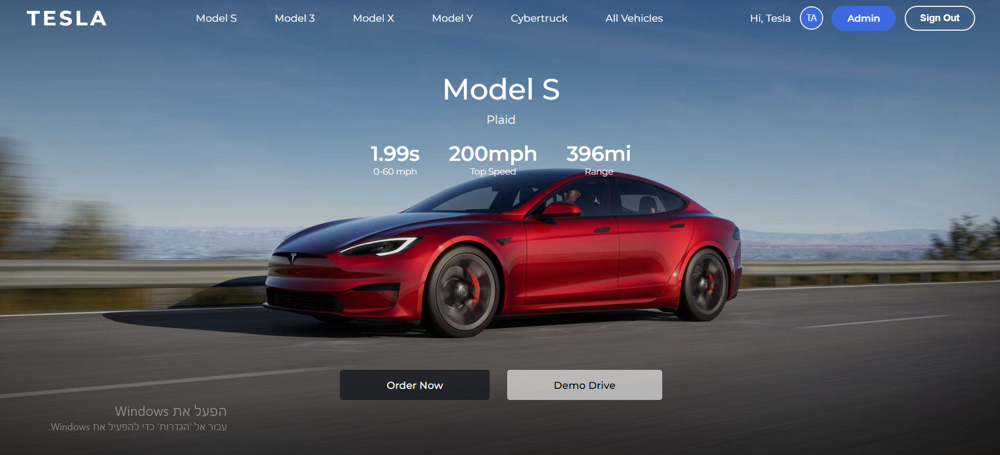
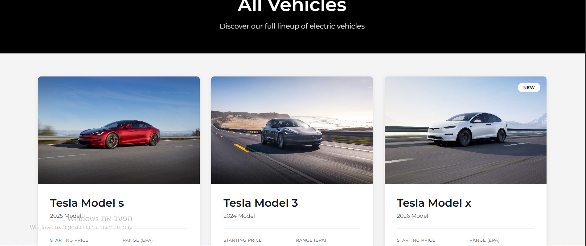
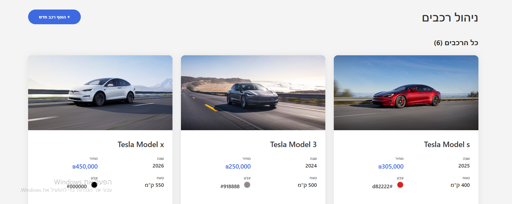

# 🚗⚡ אתר טסלה - פרויקט Devops

אתר מקצועי ומלא בהשראת טסלה עם Spring Boot בצד השרת ו-Frontend מודרני.


## 📸 צילומי מסך

### דף הבית - Model S Hero Section

*דף הבית עם Hero section מלא של Tesla Model S, כולל סטטיסטיקות ביצועים (1.99s, 200mph, 396mi)*

### גלריית רכבים - All Vehicles

*דף "All Vehicles" המציג את כל הרכבים הזמינים עם תמונות, מחירים וטווח*

### פאנל ניהול - Admin Panel

*פאנל ניהול מלא בעברית עם 6 רכבים, כולל יכולות עריכה ומחיקה*


---

## ✨ תכונות

### 🎨 Frontend
- **4 סקציות Hero** - תצוגה מלאה של Tesla Model S, 3, X, Y
- **גלריית רכבים** - עיון בכל הרכבים הזמינים עם פילטרים
- **מערכת התחברות** - Google Sign-In + Email/Password
- **פאנל ניהול** - ניהול מלא של רכבים (CRUD)
- **עיצוב רספונסיבי** - עובד מושלם על כל המכשירים
- **UI מקצועי** - פונט Montserrat, אנימציות חלקות, עיצוב בהשראת טסלה

### 🔧 Backend
- **Spring Boot** REST API
- **PostgreSQL** Database
- **JPA/Hibernate** ORM
- **CORS** מוגדר
- **Validation** וולידציה של קלט עם Hibernate Validator
- **Swagger** תיעוד API (אופציונלי)

### 🐳 DevOps
- **Docker** אפליקציה קונטיינרית
- **Docker Compose** הרצה בפקודה אחת
- **DockerHub** Image מפורסם: `elioryaffe/tesla-project`

---

## 🚀 התחלה מהירה

### דרישות מקדימות
- Java 11+
- Node.js (אופציונלי, לפיתוח)
- Docker & Docker Compose
- PostgreSQL 13+

### 🐳 הרצה עם Docker (מומלץ)

**1. שכפל את הפרויקט**
```bash
cd C:\Users\username\Downloads\project\project
docker-compose up --force-recreate
```

**2. הרץ עם Docker Compose**
```bash
docker-compose up -d
```

**3. גישה לאפליקציה**
- Frontend: `http://localhost:8081`
- API: `http://localhost:8081/api/cars/all`
- פאנל ניהול: פתח `home.html` → התחבר → Admin

**זהו! 🎉**

---

## 💻 פיתוח מקומי

### הגדרת Backend

**1. הגדר את הדאטהבייס**

צור `src/main/resources/application.properties`:
```properties
server.port=8081

spring.datasource.url=jdbc:postgresql://localhost:5432/tesla_db
spring.datasource.username=postgres
spring.datasource.password=your_password

spring.jpa.hibernate.ddl-auto=update
spring.jpa.show-sql=true
spring.jpa.properties.hibernate.dialect=org.hibernate.dialect.PostgreSQLDialect
```

**2. Build והרץ**
```bash
mvn clean package
java -jar target/tesla-project.jar
```

או עם Maven:
```bash
mvn spring-boot:run
```

### הגדרת Frontend

**1. הורד את קבצי ה-HTML**
- `home.html`
- `vehicles.html`
- `login.html`
- `admin.html`

**2. פתח בדפדפן**
```
פתח את home.html בדפדפן שלך
```
http://localhost:8081/home.html

**3. פרטי התחברות (Demo)**
```
Email: admin@tesla.com
Password: admin123
```

---

## 📁 מבנה הפרויקט

```
tesla-project/
├── src/
│   ├── main/
│   │   ├── java/com/example/tesla/
│   │   │   ├── model/
│   │   │   │   └── Car.java
│   │   │   ├── repository/
│   │   │   │   └── CarRepository.java
│   │   │   ├── service/
│   │   │   │   └── CarService.java
│   │   │   ├── controller/
│   │   │   │   └── CarController.java
│   │   │   ├── config/
│   │   │   │   └── WebConfig.java
│   │   │   └── TeslaProjectApplication.java
│   │   └── resources/
│   │       └── application.properties
│   └── test/
├── frontend/
│   ├── home.html
│   ├── vehicles.html
│   ├── login.html
│   └── admin.html
├── docker-compose.yml
├── Dockerfile
├── pom.xml
└── README.md
```

---

## 🗄️ מבנה הדאטהבייס

### טבלת Car
```sql
CREATE TABLE cars (
    id BIGSERIAL PRIMARY KEY,
    brand VARCHAR(30) NOT NULL,
    model VARCHAR(30) NOT NULL,
    year INTEGER NOT NULL CHECK (year >= 2000 AND year <= 2030),
    price DECIMAL NOT NULL CHECK (price >= 100000),
    range_km INTEGER NOT NULL CHECK (range_km >= 100 AND range_km <= 1000),
    color VARCHAR(7) NOT NULL,
    image_url TEXT
);
```

---

## 🔌 נקודות קצה (API Endpoints)

### Cars API

| Method | Endpoint | תיאור |
|--------|----------|-------|
| GET | `/api/cars/all` | קבל את כל הרכבים |
| GET | `/api/cars/{id}` | קבל רכב לפי ID |
| POST | `/api/cars` | צור רכב חדש |
| PUT | `/api/cars/{id}` | עדכן רכב |
| DELETE | `/api/cars/{id}` | מחק רכב |

### דוגמת Request

**יצירת רכב**
```bash
curl -X POST http://localhost:8081/api/cars \
  -H "Content-Type: application/json" \
  -d '{
    "brand": "Tesla",
    "model": "Model S",
    "year": 2024,
    "price": 450000,
    "rangeKm": 650,
    "color": "#000000",
    "imageUrl": "https://digitalassets.tesla.com/..."
  }'
```

**תגובה (Response)**
```json
{
  "id": 1,
  "brand": "Tesla",
  "model": "Model S",
  "year": 2024,
  "price": 450000.0,
  "rangeKm": 650,
  "color": "#000000",
  "imageUrl": "https://digitalassets.tesla.com/..."
}
```

---

## 🎨 תמונות טסלה רשמיות

השתמש בתמונות הרשמיות האלה מ-CDN של טסלה:

```
Model S: https://digitalassets.tesla.com/tesla-contents/image/upload/f_auto,q_auto/Model-S-Main-Hero-Desktop-LHD.png
Model 3: https://digitalassets.tesla.com/tesla-contents/image/upload/f_auto,q_auto/Model-3-Main-Hero-Desktop-LHD.png
Model X: https://digitalassets.tesla.com/tesla-contents/image/upload/f_auto,q_auto/Model-X-Main-Hero-Desktop-LHD.png
Model Y: https://digitalassets.tesla.com/tesla-contents/image/upload/f_auto,q_auto/Model-Y-Main-Hero-Desktop-LHD.png
```

### פלטת צבעים של טסלה
```
לבן פנינה:      #FFFFFF
שחור מוצק:      #000000
כסף חצות:       #31363D
כחול עמוק:      #0B1C3D
אדום רב-שכבות:  #C50A21
אדום אולטרה:    #DC0A14
```

---

## 🐳 הגדרות Docker

### docker-compose.yml
```yaml
version: "3"
services:
  appserver:
    container_name: server
    image: elioryaffe/tesla-project:tesla-project-001
    ports:
      - 8081:8081
    depends_on:
      - db
  db:
    image: postgres
    environment:
      POSTGRES_PASSWORD: postgres
    ports:
      - 5432:5432
    volumes:
      - ./postgresdata:/var/lib/postgresql/
    privileged: true
```

### הורדה מ-DockerHub
```bash
docker pull elioryaffe/tesla-project:latest
```

---

## 🔧 הגדרות

### שינוי פורט
ערוך את `application.properties`:
```properties
server.port=8081
```

עדכן את קבצי ה-HTML:
```javascript
const API = 'http://localhost:8081/api/cars';
```

### הגדרות דאטהבייס
```properties
spring.datasource.url=jdbc:postgresql://db:5432/your_db
spring.datasource.username=your_username
spring.datasource.password=your_password
```

---

## 🛠️ סטאק טכנולוגי

### Backend
- **Java 11**
- **Spring Boot 2.5.2**
- **Spring Data JPA**
- **PostgreSQL**
- **Hibernate Validator**
- **Maven**

### Frontend
- **HTML5**
- **CSS3** (עיצוב מותאם אישית)
- **Vanilla JavaScript**
- **פונט Montserrat**

### DevOps
- **Docker**
- **Docker Compose**
- **GitHub Actions** (אופציונלי)

---

## 📝 מפת דרכים (Roadmap)

- [ ] אימות משתמשים עם JWT
- [ ] העלאת תמונות
- [ ] חיפוש ופילטרים לרכבים
- [ ] עגלת קניות
- [ ] אינטגרציית תשלומים
- [ ] התראות במייל
- [ ] Unit tests
- [ ] Integration tests
- [ ] CI/CD pipeline

---

## 🤝 תרומה לפרויקט

תרומות מתקבלות בברכה! אל תהסס לשלוח Pull Request.

1. Fork את הפרויקט
2. צור branch לתכונה שלך (`git checkout -b feature/AmazingFeature`)
3. Commit את השינויים (`git commit -m 'Add some AmazingFeature'`)
4. Push ל-branch (`git push origin feature/AmazingFeature`)
5. פתח Pull Request

---

## 📄 רישיון

הפרויקט הזה מורשה תחת רישיון MIT - ראה את קובץ [LICENSE](LICENSE) לפרטים.

---

## 👨‍💻 יוצר

**אליאור יפה**

- GitHub: [@elioryaffe](https://github.com/elioryaffe)
- DockerHub: [elioryaffe/tesla-project](https://hub.docker.com/r/elioryaffe/tesla-project)

---

## 🙏 תודות

- טסלה על ההשראה לעיצוב
- קהילת Spring Boot
- צוות PostgreSQL
- קהילת Docker

---

---

<div align="center">

### ⭐ תן כוכב לפרויקט אם מצאת אותו שימושי!

**נוצר באהבה ❤️ על ידי אליאור יפה**

</div>

